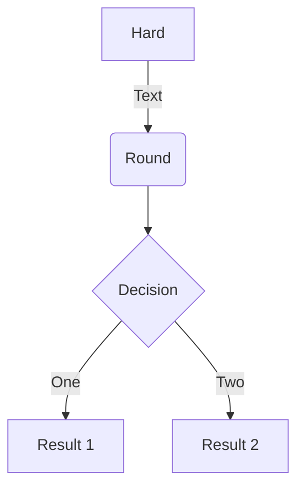
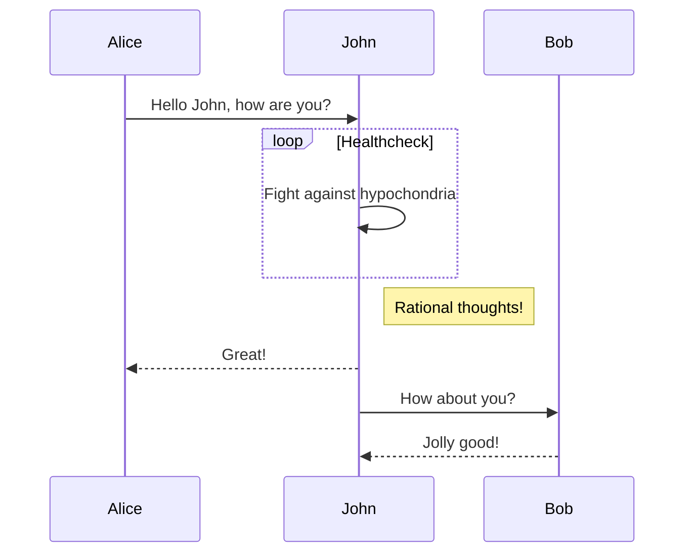

Academic is designed to give technical content creators a seamless experience.
You can focus on the content and Academic handles the rest.

****Highlight your code snippets, take notes on math classes, and draw diagrams from textual representation.****

On this page, you'll find some examples of the types of technical content that can be rendered with Academic.


##### Examples {#examples}


###### Code {#code}

Academic supports a Markdown extension for highlighting code syntax. You can enable this feature by toggling the \`highlight\` option in your \`config/\_default/params.toml\` file.

```text
```python
import pandas as pd
data = pd.read_csv("data.csv")
data.head()
```
```

renders as

```python
import pandas as pd
data = pd.read_csv("data.csv")
data.head()
```


###### Math {#math}

Academic supports a Markdown extension for \\(\LaTeX\\) math. You can enable this feature by toggling the \`math\` option in your \`config/\_default/params.toml\` file.

To render **inline** or **block** math, wrap your LaTeX math with \`$...$\` or \`\\[...\\]\`, respectively.

Example ****math block****:

```text
```tex
$$\gamma_{n} = \frac{
\left | \left (\mathbf x_{n} - \mathbf x_{n-1} \right )^T
\left [\nabla F (\mathbf x_{n}) - \nabla F (\mathbf x_{n-1}) \right ] \right |}
{\left \|\nabla F(\mathbf{x}_{n}) - \nabla F(\mathbf{x}_{n-1}) \right \|^2}$$
```
```

renders as

\\[\gamma\_{n} = \frac{ \left | \left (\mathbf x\_{n} - \mathbf x\_{n-1} \right )^T \left [\nabla F (\mathbf x\_{n}) - \nabla F (\mathbf x\_{n-1}) \right ] \right |}{\left \\|\nabla F(\mathbf{x}\_{n}) - \nabla F(\mathbf{x}\_{n-1}) \right \\|^2}\\]

Example ****inline math**** \`\\(\nabla F(\mathbf{x}\_{n})\\)\` renders as \\(\nabla F(\mathbf{x}\_{n})\\).

Example ****multi-line math**** using the \`\\\\\` math linebreak:

```text
```tex
$$f(k;p_0^*) = \begin{cases} p_0^* & \text{if }k=1, \\
1-p_0^* & \text {if }k=0.\end{cases}$$
```
```

renders as

\\[f(k;p\_0^\*) = \begin{cases} p\_0^\* & \text{if }k=1, \\\\\\
1-p\_0^\* & \text {if }k=0.\end{cases}\\]


###### Diagrams {#diagrams}

Academic supports a Markdown extension for diagrams. You can enable this feature by toggling the \`diagram\` option in your \`config/\_default/params.toml\` file or by adding \`diagram: true\` to your page front matter.

An example ****flowchart****:

```text

```

renders as


An example ****sequence diagram****:

```text

```

renders as


-   [ ] a
-   [X] b
-   [X] c
